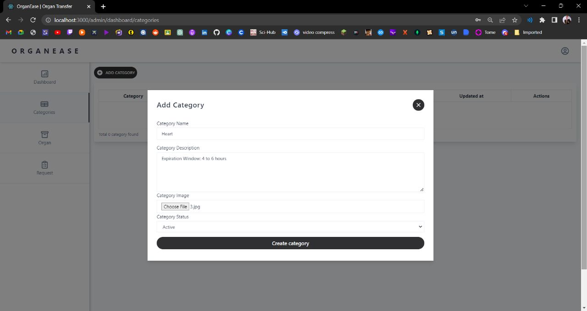
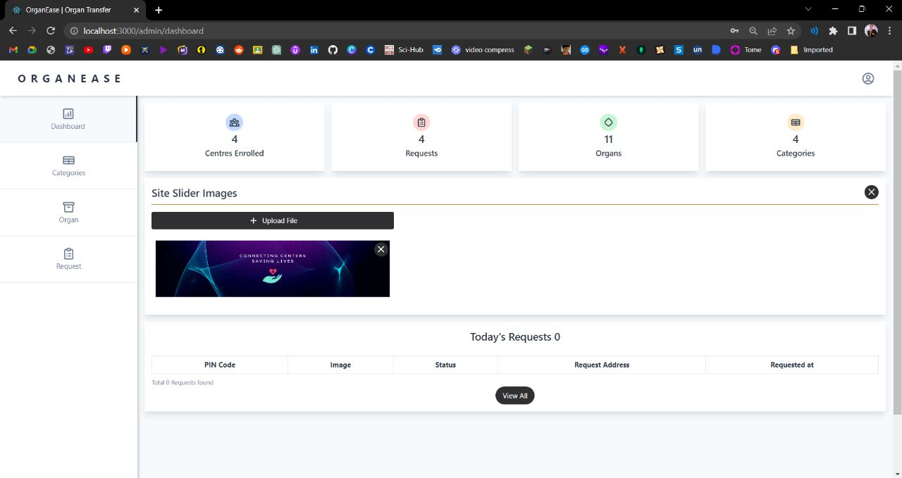
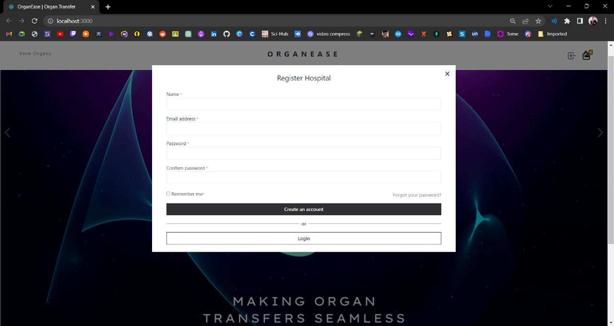
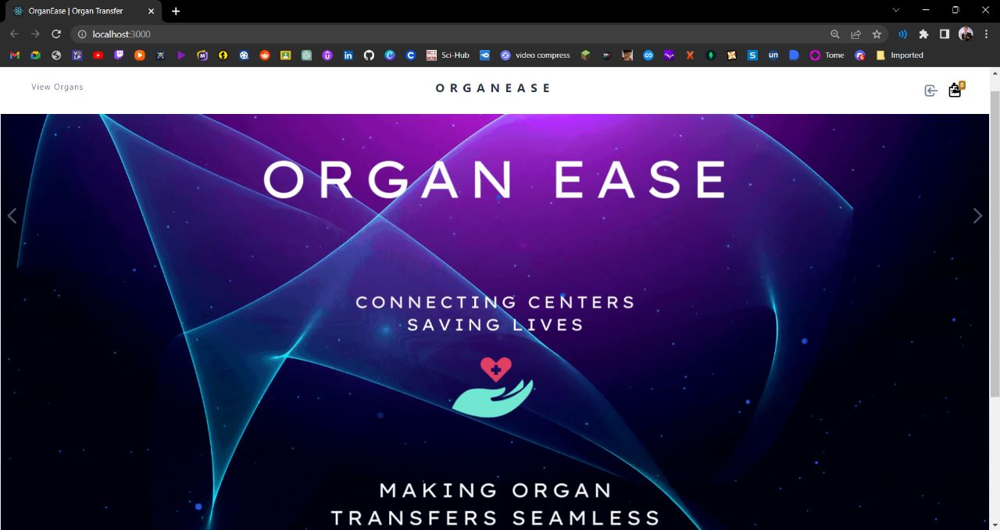
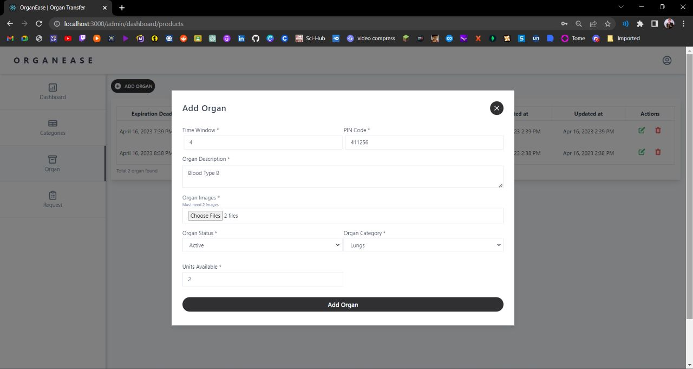
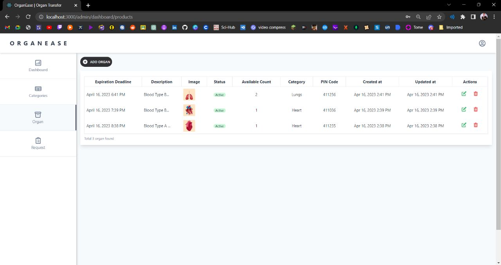

### Prerequisites

NPM and Node.js installed

### Installing

Steps for Installing NPM modules on both client and server folders

Execute these commands from the project directory

```
cd client && npm install
```

```
cd server && npm install
```

### Running the app

Open a terminal on server directory

```
npm start:dev
```

and open another terminal on client directory
```
npm start
```


### Access the web app on your system at http://localhost:3000/

<hr>

### Screenshots

<p align="center">
  
</p>

<p align="center">
  
</p>

<p align="center">
  
</p>

<p align="center">
  
</p>

<p align="center">
  
</p>

<p align="center">
  
</p>

<hr>

As organs are needed ASAP for operations, time is the most crucial aspect. However, the existing method to request organs from procurement centre/ transplant centres is completely manual (manual data entry, manual communication via faxes, mails, phone calls) and thus is obviously error prone and time consuming. Therefore to solve this grave issue, 'OrganEase' is proposed. 

The website makes the tedious manual task of categorizing different organs and making entries for each, mere clicks away. In a particular region, say n number of procurement centres and/or transplant centres exist. All of them can display the organs stored in their hypothermic storages along with their details at one time (this completely solvesthe time-consuming problem of individually calling of procurement centres one by one which is done presently). 

Hospitals can request organs of suitable compatibility (Blood Group, etc) via the portal itself and make a payment which serves as a token of confirmation for the transfer procedure. Thereafter, the procurement centre has the option to confirm the request from their side.
